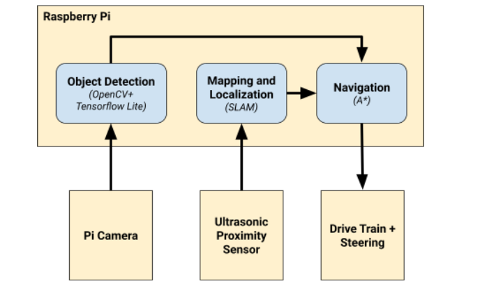
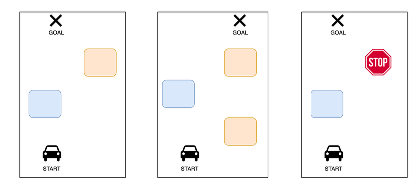
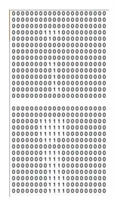
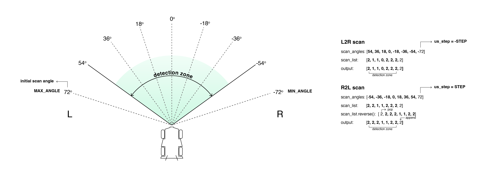
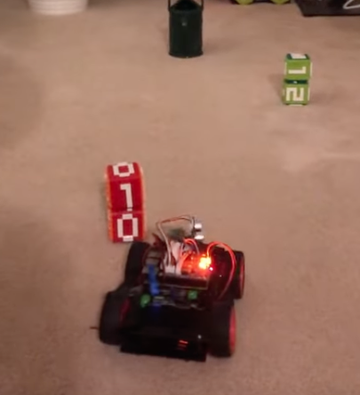
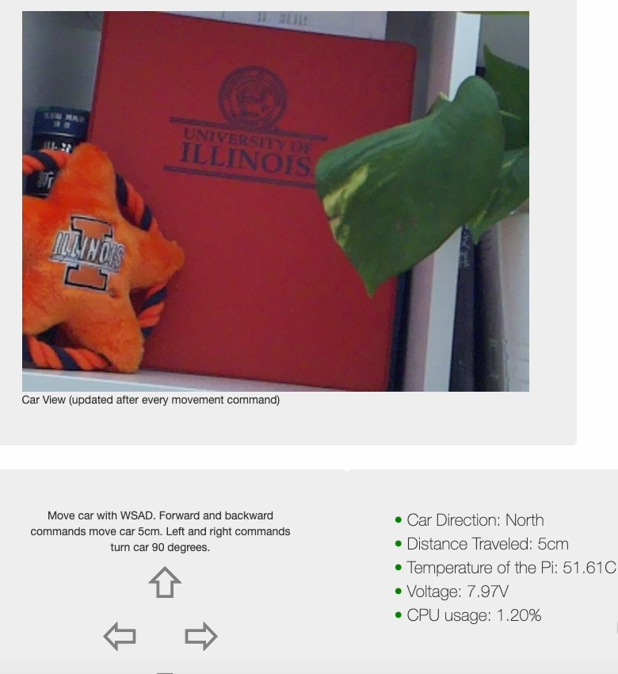
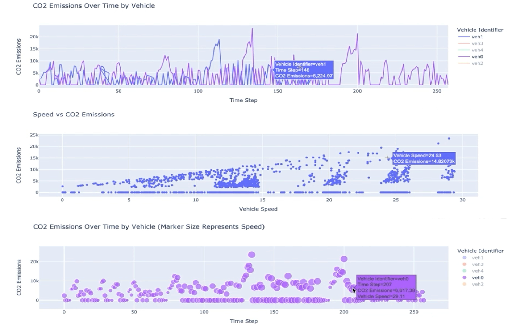

## AutoVista: An Intelligent Wireless and Cloud-based IoT Platform
+ [1. Introduction](#1-introduction)
+ [2. Hardware Assembly and Topology](#2-Hardware-Assembly-and-Topology)
+ [3. Autonomous Navigation and Object Detection](#3-Autonomous-Navigation-and-Object-Detection)
+ [4. Remote Control App](#4-Remote-Control-App)
+ [5. Cloud-Based Infrastructure](#5-Cloud-Based-Infrastructure)
  
Project team: Xiaoran Du, Brandon Ruffridge, Benjamin Centner (Department of Computer Science, University of Illinois at Urbana-Champaign)

### 1. Introduction
+ **Technologies: Python, Raspberry Pi, TensorFlow, ElectronJS, AWS IoT**
+ Engineered a PiCar-4WD smart car with **Raspberry Pi**, implementing autonomous navigation and object detection.
+ Developed a remote-control web application using **ElectronJS** for real-time sensor data acquisition via Wi-Fi.
+ Architected and deployed a cloud-based infrastructure on **AWS IoT** for communication, data inference and visualization.

### 2. Hardware Assembly and Topology
 


### 3. Autonomous Navigation and Object Detection
+ Architecture overview
  
  
  
+ The fully assembled PicCar-4WD smart car can implement to move under its own power, and be clearly able to perceive its environment. Upon encountering an obstacle, the car can navigate around the obstacle in soem fashions.
+ Implement a more advanced mapping algorithm to indicating obstacles, and utilize A* algorithm for route exploring. See the [A* algorithm code walkthrough](https://youtu.be/U0xKGmVCl6E) for more information.
+ Utilize OpenCV for image preprocessing and TensorFlow Lite’s Interpreter API for automate object detection.
  + The code snip below shows how to identify specific objects (a person, traffic light, and stop sign) in the car's environment using an object detection model. For each detected object, it checks the category and confidence score, and based on these, it decides whether to perform specific actions.
  ```
    # Detect specific objects
    for detection in detection_result.detections:
      category = detection.categories[0]
      category_name = category.category_name

      # PERSON
      if category.index == 0 and category.score > .75:
        # stop until person is no longer detected
        print('Car detects a person.')

      # TRAFFIC LIGHT
      if category.index == 9 and category.score > .75:
        pass

      # STOP SIGN
      if category.index == 12 and category.score > .75:
        #sees a stop sign. 
        print('Car detects a stop sign.')
        # stop for N seconds before continuing.
  ```

  + Mapping, obstacle setup, and environment scan
  
  
  
  
+ [Demo video](https://youtube.com/shorts/dfeAq3dMvkA?feature=share)

[](https://youtube.com/shorts/dfeAq3dMvkA?feature=share)

### 4. Remote Control App
+ The remote control web app, built with ElectronJS, enables communication with the server (PiCar) to control the car's movement. It also reads real-time sensor data from the car and displays it.
+ [Demo video](https://youtu.be/uJGQxwn_bd4)



### 5. Cloud-Based Infrastructure
+ A robust cloud-based infrastructure is designed using various IoT components, including AWS IoT Hub, Greengrass, IoT Core, IoT Analytics, and IoT Device Defender. These components work together to ensure seamless communication, data processing, and device management within the IoT ecosystem.
+ A Lambda function is created within AWS IoT, with precise rules for analyzing vehicle emission levels. This function processes the data and sends the analysis results back to the originating device, facilitating real-time monitoring and feedback.
+ A comprehensive data pipeline is established using IoT Analytics and Amazon SageMaker, enabling the visualization and analysis of collected data. This pipeline supports advanced data insights, contributing to more informed decision-making processes.
  
+ [Demo video](https://youtu.be/gOh5IIVipWs)
  
  The video demonstrates the construction of the cloud-based infrastructure, data inference, and data visualization.
  
+ Data visualization
  

